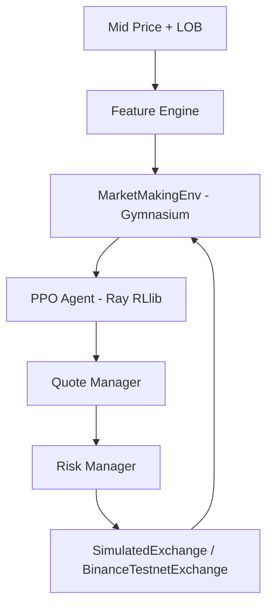

# RL Market Maker

Production-quality Reinforcement Learning Market Maker for cryptocurrency, using Ray RLlib PPO on a simulated limit order book. No real-money orders — only Binance Testnet or local simulation.

## Architecture



- `src/market_maker/market_data/order_book.py` — LOB engine with snapshot + incremental updates, sequence validation, crossed-book recovery, stale detection.
- `src/market_maker/exchange/simulated_exchange.py` — deterministic simulator with queue-aware / conservative fill models, fees, latency, partial fills.
- `src/market_maker/environment/market_maker_env.py` — Gymnasium env. Continuous 5-dim action: `[bid_offset_bps, ask_offset_bps, bid_size_ratio, ask_size_ratio, inventory_skew]` mapped to quotes with tick/lot rounding and inventory safety clamps.
- `src/market_maker/environment/reward.py` — risk-adjusted reward: `ΔPnL - costs - inventory_penalty - adverse_selection - cancel_penalty - risk_penalty`
- `src/market_maker/features/lob_features.py` — price, depth (N levels), imbalance, microstructure features; normalization.
- `src/market_maker/exchange/binance_testnet.py` — testnet adapter (spot `https://testnet.binance.vision`). Production endpoints rejected.
- `src/market_maker/evaluation/` — metrics (Sharpe, drawdown), fixed-spread & inventory-skew baselines, backtest with identical replay.

## RL Formulation

**Observation** — depth levels ×4 (bid/ask price offset from mid, qty), imbalance, spread_bps, microprice offset, `weighted_mid`, inventory/ratio, cash, PnL, open orders, step ratio. Normalized, no future leakage (timestamp-aware).

**Action** — `Box([-1,-1,-1,-1,-1], [1,1,1,1,1])`:
- `bid_offset_bps = a0*50`, `ask_offset_bps = a1*50`
- `size_ratio = (a+1)/2*1.9+0.1` → `0.1..2.0×base_qty`
- `inventory_skew` adjusts offsets under high inventory.
Clamped to tick/lot, `bid<ask`, position limits.

**Reward** — `reward = pnl_weight*ΔPortfolio - tx_cost - |inv|*inv_penalty*(spread/10000) - adv*weight - cancels*0.01 - risk_violation*0.2`. Coefficients configurable in `configs/*.yaml`.

Simulator models fees (maker 1 bps, taker 5 bps), partial fills (10% chance), queue decay, jump diffusion, mean reversion.

## Installation

```bash
python -m venv .venv
# Windows
.venv\Scripts\activate
pip install -r requirements.txt
# or
pip install -e .
```

Environment:
```bash
cp .env.example .env
# Edit .env — ENVIRONMENT=simulation or testnet
# BINANCE_TESTNET_API_KEY / SECRET only for testnet
```

## Configuration

All values in `configs/base.yaml`, overridden by `simulation.yaml` / `testnet.yaml` / `training.yaml`. Env vars (`ENVIRONMENT`, `SYMBOL`, `LOG_LEVEL`) override YAML.

Key configs: `symbol`, `max_inventory`, `tick_size`, `fill_model`, `reward.*`, `ppo.*`.

## Data

- Synthetic: `python scripts/generate_simulation_data.py --steps 100000 --output data/synthetic_lob.jsonl`
- Live capture (testnet): `python scripts/collect_lob.py` — if market-data limitations, falls back to simulator (logs explanation). Replay supported via `MarketDataReplayer`.

## Training

```bash
PYTHONPATH=src python scripts/train.py --config configs/training.yaml --iters 20 --checkpoint-dir models
```

Loads LOB data (or synthetic), creates `MarketMakingEnv`, initializes PPO via `ray.rllib`, trains, saves checkpoints `models/`, exports metrics. Without Ray installed, runs sanity env loop (still verifies env correctness).

Parameters: `num_workers`, `train_batch_size`, `lr`, `gamma`, `lambda`, `clip_param`, `entropy_coeff` configurable.

## Evaluation

```bash
PYTHONPATH=src python scripts/evaluate.py --steps 2000 --output reports/evaluation.json
PYTHONPATH=src python scripts/backtest.py --steps 2000 --output reports/backtest.json
```

Backtest replays same market for `fixed_spread`, `inventory_skew`, and RL policy; outputs equity curve, inventory curve, metrics in `reports/`.

Metrics: total/realized/unrealized PnL, Sharpe (warn if n<~50), max drawdown, inventory variance, fill rate, spread captured, adverse selection, transaction costs, order counts.

## Testing

```bash
PYTHONPATH=src python -m pytest tests/unit tests/integration -v
# Testnet (skipped without creds)
PYTHONPATH=src python -m pytest tests/testnet -v
# Connectivity
PYTHONPATH=src python scripts/test_testnet_connection.py
```

Unit covers LOB updates, consistency, spread/microprice, imbalance, features, reward, inventory, fills, PnL, quote generation, risk limits. Integration covers simulated exchange, env, RLlib init, checkpoint.

## Binance Testnet

`BinanceTestnetExchange` implements `ExchangeBase` with same interface as `SimulatedExchange`. Verified via `scripts/test_testnet_connection.py`. Requires `BINANCE_TESTNET_API_KEY/SECRET` in `.env`. Never connects to `api.binance.com` — constructor enforces testnet URL.

## Security

- `ENVIRONMENT=simulation|testnet` enforced; `production` rejected.
- No hardcoded secrets; `.env` in `.gitignore`; provide `.env.example`.
- Secrets never logged.
- Adapter validates testnet base URL.

## Known Limitations

- Binance Testnet spot only; futures/perpetual not implemented; depth stream differences vs production documented in `BinanceTestnetExchange`.
- Fill model is approximation: queue-aware uses random queue position decay, not real queue reconstruction; no latency distribution beyond constant; slippage modeled via spread only.
- Simulator assumes zero market impact; synthetic GBM with mean reversion does not replicate real microstructure regimes.
- RL: PPO on synthetic data — sim-to-real gap, overfitting to synthetic regimes, non-stationarity, reward hacking risk (inventory penalty tuned conservatively).
- Sharpe reported only meaningful with >100 episodes; single-run variance high.
- No real PostgreSQL tested; SQLite default; asyncpg support architectural only.

## Observability

Structured logs via `loguru`: `LOB_UPDATE`, `ORDER_SUBMITTED`, `ORDER_FILLED`, `ORDER_CANCELLED`, `POSITION_CHANGED`, `PNL_UPDATE`, `RISK_LIMIT`, `RL_ACTION`, `RL_REWARD`, `WEBSOCKET_RECONNECT`, `ERROR`.

## Dashboard

```bash
PYTHONPATH=src uvicorn market_maker.api.main:app --reload
# http://localhost:8000/dashboard
```

Displays mid, spread, inventory, PnL, RL action, order status.

## Docker

```bash
docker compose up --build
```

## Project Status

See `reports/final_validation.md` for implementation, test, training, and baseline comparison results.
