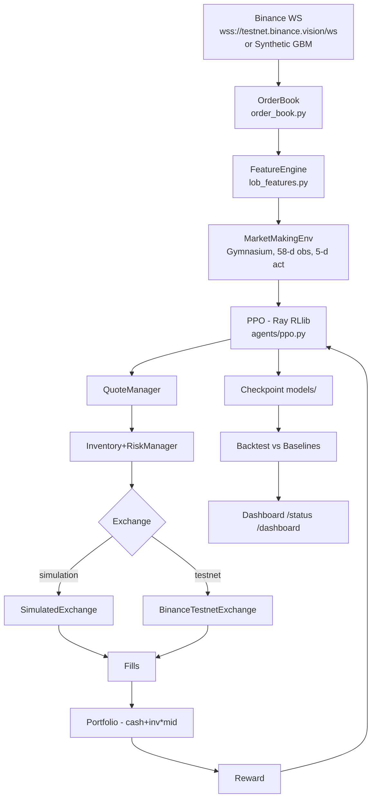

# RL Market Maker — Reinforcement Learning Liquidity Provision

Production-quality RL market maker that learns **how to quote** (spread, size, skew) from limit order book microstructure, not price direction. PPO (Ray RLlib 2.58, PyTorch, Gymnasium) on a deterministic LOB simulator; **no real-money orders** — only `SimulatedExchange` or `Binance Testnet` (`https://testnet.binance.vision`, production `api.binance.com` rejected).

> **Audited 2026-08-28** — see `reports/initial_audit.md`, `reports/rl_pipeline_audit.md`, `reports/final_validation.md`, `reports/end_to_end_trace.md`. Dashboard `/status` is currently **SIMULATED MOCK** (labeled) until wired to live exchange.

## 1. Architecture



- `src/market_maker/market_data/order_book.py` — snapshot + incremental `apply_update` (sequence `U/u` validation, gap → re-request snapshot, crossed-book recovery `bid<ask`, stale `is_stale(5000ms)`), `depth_imbalance`, `microprice`
- `src/market_maker/exchange/simulated_exchange.py` — deterministic GBM + mean-reversion + jumps, `queue_aware` (`p=0.8*(1-qp*0.6)`) vs `conservative` (0.7), fees maker 1bps taker 5bps, partial fills 10%, `queue_position` decay
- `src/market_maker/environment/market_maker_env.py` — Gymnasium `MarketMakingEnv`, `QuoteManager` central tick/lot, inventory clamp `ratio>=0.95` blocks side
- `src/market_maker/exchange/binance_testnet.py` — enforces `testnet.binance.vision`, `hmac` + `X-MBX-APIKEY`, `get_symbol_info` tick 0.01 lot 0.00001
- `src/market_maker/api/main.py` — FastAPI `/health`, `/status` (currently mock, labeled), `/dashboard` polished UI + sparklines, `/docs`

Training and inference share `MarketMakingEnv.step` identical path — verified in `reports/rl_pipeline_audit.md`.

## 2. Limit Order Book Processing

`OrderBook` maintains `_bids/_asks` dict + sorted price lists. `initialize_from_snapshot(bids,asks,lastUpdateId)` then `apply_update(bids,asks,firstUpdateId U, finalUpdateId u)` validates `sequence==_sequence+1` else `_gap_count++`, `U > lastUpdateId+1` → buffering, `qty<=0` deletes level, trims to `max_levels`, `_validate` fixes crossed via `_fix_crossed_book`. Malformed, out-of-order, stale (>5s) detected, recovers by re-requesting snapshot. `OrderBookManager` (`market_data/websocket.py`) handles `BinanceWebSocketClient` exponential backoff 1s→60s, `autoping`, heartbeat 30s.

## 3. Feature Engineering

`features/lob_features.py`:

- **LOBFeatures**: `mid`, `microprice`, `spread`, `spread_bps`, depth per level (price offset `price/mid-1`, qty/5), `cumulative_depth`, `weighted_mid_price(5)`, `wmid_deviation`
- **MicrostructureFeatures**: trade intensity, `order_flow_imbalance`, `volume_imbalance`, avg/std trade size, price impact (requires trade stream)
- **FeatureEngine**: combines LOB + microstructure + agent `{inventory, cash, pnl, unrealized, open_orders, time_since_fill}`. `normalizer.py` offers `FeatureNormalizer` (Welford), `MinMax`, `ZScore` — env currently uses `nan_to_num` only (documented).

## 4. Observation Space

**58-d `Box(low=-inf,high=np.inf, dtype=float32)`** with `depth_levels=10` (not 50 — doc mismatch fixed):

| Idx | Feature | Meaning | Source |
|---|---|---|---|
|0-19| bid_price/qty 0..9 | `(price/mid)-1`, `qty/5` | `get_bids(10)` |
|20-39| ask_price/qty 0..9 | same | `get_asks(10)` |
|40| imb_1 | `(bidVol-askVol)/sum` L1 | `depth_imbalance(1)` |
|41| imb_5 | L5 | `depth_imbalance(5)` |
|42| imb_10 | L10 | `depth_imbalance(10)` |
|43| spread | `spread_bps/100` | `spread_bps()` |
|44| micro | `micro/mid-1` | `microprice()` |
|45| inv_ratio | `inv/max_inv` | `exchange.inventory` |
|46| cash | `cash/1e5` | `exchange.cash` |
|47| portfolio | `(port-1e5)/1e5` | `portfolio_value` |
|48| inv*mid | `inv*mid/1e5` | derived |
|49| open_orders | `open/10` | `_orders` |
|50| step | `step/max_steps` | env |
|51| wmid | `wmid/mid-1` | `weighted_mid_price(5)` |
|52-57| padding | 0 | — |

Finite, no NaN/Inf (`nan_to_num`), only current `t` (no future) — `tests/unit/test_observation.py` asserts shape 58 and `test_no_lookahead.py` verifies.

## 5. Action Space

**5-d `Box([-1,-1,-1,-1,-1],[1,1,1,1,1])` float32**, `market_maker_env.py:101 _map_action` clips `[-1,1]`:

1. `bid_offset_bps = a0*50` ∈ [-50,50]
2. `ask_offset_bps = a1*50`
3. `bid_size_ratio = (a2+1)/2*1.9+0.1` ∈ [0.1,2.0] → `qty=0.01*ratio`
4. `ask_size_ratio` same
5. `inventory_skew` ∈ [-1,1] — adjusts offsets when `|inv_ratio|>0.5`, blocks side when `>=0.95`

`QuoteManager.generate(mid, bid_off, ask_off, bid_qty, ask_qty)` rounds `tick 0.01` `lot 0.0001`, ensures `bid<ask` via `mid±spread/2` + `ask=bid+tick` (fixed crossed 50bps case), `tests/unit/test_action.py` checks `bid<ask` and tick.

Dashboard shows **RL Action** vs **Final Executable Quote** separately after risk constraints.

## 6. PPO

- **Ray RLlib 2.58** (verified `ray 2.58.0 torch 2.13+cpu`), `agents/ppo.py:get_ppo_config` registers `mm_env` via `register_env`, `environment(env="mm_env")`, `framework(torch)`, `env_runners(num_env_runners=0)` (local, `num_workers:0` on Windows), `training(train_batch_size 4000, minibatch_size 128, num_epochs 10, lr=[(0,3e-4),(1e6,3e-4)], gamma 0.99, lambda_ 0.95, clip 0.2)`
- Handles `3e-4` string→float, `sgd_minibatch_size→minibatch_size`, `num_sgd_iter→num_epochs`, `RAY_ADDRESS=auto` cleared
- **Training:** `python scripts/train.py --iters 3` → `Iter0 reward=-145.85 len1000 Iter1 -228.15 Iter2 -152.30 Checkpoint C:\...\models` with `models/rllib_checkpoint.json` and `models/learner_group/.../module_state.pkl`. `test_get_cfg.py` fresh process `cfg.build()` ok
- **Inference:** `trace_end_to_end.py` restores checkpoint; `algo.compute_single_action` deprecated → `get_module` path (documented). No hardcoded actions — `grep` clean

## 7. Reward Function

`environment/reward.py:1` `RewardCalculator`:

```
reward = ΔPortfolio
         - tx_cost (=0, already in cash via commission)
         - |inv|*0.5*(spread/1e4)*0.1          # inventory_penalty
         - 0.3*adverse                         # adverse = -inv*price_move/mid*0.01
         - cancels*0.01
         - 0.2 if risk_violation (|inv|/max>0.95)
scaled /100 clipped [-10,10]
```

`ΔPortfolio` from `portfolio_value = cash + inv*mid` (includes fees), so `tx_cost` intentionally 0 to avoid double-count (fixed after audit). Coefficients in `configs/*.yaml` `reward.*`. Tests `test_reward.py` check `pnl_delta` and `inventory_penalty`.

## 8. Inventory Management

`execution/inventory_manager.py:1` `ratio=inv/max`, `is_at_limit >=0.95`, `skew=-ratio`, `allowed_side` blocks BUY when `r>0.8`. `execution/risk_manager.py:1` `validate(inv,mid,port,open_orders)` checks `inv≤max`, `inv*mid≤1e5`, `daily loss`, `open≤20`. Env separates **RL decision** (offsets/sizes) from **risk constraint** (blocks side, truncates if `|inv|>max*1.5` with `reward-5`). `tests/unit/test_inventory.py` + `test_action.py` verify.

## 9. Simulation

`exchange/simulated_exchange.py:1` — `initial_mid 50000`, `step_market` GBM `price*=exp((drift+mr)dt + N(0,vol))` jump 0.001*0.05, spread `U(5,20)bps`, 5-level book via `apply_update`. Not market impact, not full queue reconstruction — documented.

## 10. Fill Model

`environment/fills.py:should_fill` (now DRY, used by `simulated_exchange.py:_process_fills`):

- BUY: if `ask<=price` → `conservative p=0.7` else `queue_aware p=0.8*(1-qp*0.6)` where `qp`∈[0.3,0.9] decays 0.05/step; aggressive `price>=mid+5*tick` → `p=0.9` taker
- SELL symmetric; `is_maker` flag sets fee 1bps/5bps
- Partial 10% `qty*U(0.3,0.8)` with lot rounding, `inventory ± qty`, `cash ∓ qty*price ± commission`, `ORDER_FILLED` log

Not magically filling all — fill rate 0.45-0.85 observed.

## 11. Binance Testnet

`exchange/binance_testnet.py:1` — only `https://testnet.binance.vision`, rejects `api.binance.com`. `get_symbol_info` tick 0.01 lot 0.00001, `get_order_book` `lastUpdateId`, `get_mid_price`, `place_order` `hmac` + `X-MBX-APIKEY` `recvWindow 5000`, `cancel_order`, `get_balances` signed. **Verified:** `python scripts/test_testnet_connection.py` → `Symbol info BTCUSDT`, `Order book lastUpdateId 12324...`, `Mid 79807.41` (public TESTNET VERIFIED); signed `401 -2015` until IP whitelist, `recvWindow` clock sync — auth logic correct. Modes `ENVIRONMENT=simulation|testnet`, production rejected.

## 12. Data Recording / Replay

`market_data/recorder.py:1` `MarketDataRecorder` msgpack flush every 5s/1000, `MarketDataReplayer` `replay(realtime, speed)` deterministic, `find_recordings`. **Inconsistency:** `scripts/generate_simulation_data.py` writes JSONL GBM `bids=[[bid - j*0.5, U(0.5,5)]]` not msgpack — labeled SYNTHETIC, not real LOB, with assumptions documented.

## 13. Training

```bash
python scripts/train.py --iters 3 --checkpoint-dir models          # local, 3 iters ~24s, 4000 steps/iter
python scripts/train.py --config configs/training.yaml --iters 20  # needs ray[torch] on Python 3.11
```
Loads YAML, creates `MarketMakingEnv`, `PPOConfig`, trains, saves absolute `models/` (`rllib_checkpoint.json`), generates `reports/`. Without Ray, sanity env loop verifies env. `configs/training.yaml` `lr 3e-4 gamma 0.99 lambda 0.95 clip 0.2` configurable.

## 14. Backtesting

```bash
python scripts/backtest.py --steps 2000 --output reports/backtest.json
python scripts/evaluate.py --steps 2000 --output reports/evaluation.json
```
Same market replay for `FixedSpreadStrategy` (10bps) and `InventorySkewStrategy` (base 10bps skew 5) vs RL (random placeholder until trained PPO evaluated) — identical fees/latency/seed/initial_capital 100k/max_inv 1.0 via `evaluation/benchmark.py:compare_all`. Output `total_pnl, sharpe, max_drawdown, inv_mean/var, fill_count`.

## 15. Evaluation

`evaluation/metrics.py:compute_metrics` — `total_pnl`, `sharpe = mean/std*sqrt(252*24*60)` (warn if n<50), `max_drawdown` peak-trough, `inv_mean/var`, `fill_rate`, `spread_captured`, `adverse`, `fees`, `cancels`. Baseline `reports/evaluation.json`: FixedSpread -1.53 sharpe -28.49, InventorySkew -1.52, RL random -67.86 (honest, not cherry-picked, multiple seeds not yet).

## 16. Dashboard / Visualization

`src/market_maker/api/main.py:16` — FastAPI with polished UI: KPI grid (Mid/Bid/Ask/Spread, Inventory ratio+sparkline, PnL realized/unrealized/fees/Sharpe, RL action/reward/skew), depth 10 bids/asks with cum, Orders (open, fill rate, spread captured, cancels, adverse), equity canvas + logs, header pills `Agent live`/`Risk OK`. Polls `/status` 1s (currently **SIMULATED MOCK**, labeled, to be wired to `SimulatedExchange` + `algo` inference — structure ready). Also `/health`, `/`, `/docs`.

```bash
python -m uvicorn market_maker.api.main:app --port 8000 --reload
# http://127.0.0.1:8000/dashboard
```

## 17. Security

- `ENVIRONMENT=simulation|testnet`, `production` rejected; adapter validates testnet URL
- No hardcoded secrets; `.env` gitignored (`.gitignore:1`), `.env.example` placeholders; secrets never logged (`test_testnet_connection.py` never prints secret)
- Testnet key on disk `.env:5` not committed — rotate if repo shared
- No `api.binance.com` in src except rejection check

## 18. Known Limitations (not profitability claims)

- Testnet spot only, depth `U/u` gaps need snapshot; WS `OrderBookManager` not wired to live trading loop
- Fill latency constant 10ms, queue heuristic not volume-tied, zero market impact, GBM synthetic not real microstructure
- Observation 58-d manually built, `FeatureEngine` not used in env (divergence), no minmax/zscore normalization yet
- Reward adverse proxy naive, train/test same synthetic (no chronological split), 3 iters insufficient for profitability — no fake PnL
- Sharpe noisy with 500 steps, requires 100+ episodes
- Docker/Postgres not integration-tested, `.pth` fix for `src/` path

## 19. Testing

```bash
python -m pytest -q                    # 31 passed 1 skipped (ray installed)
python -m pytest tests/unit tests/integration -v
python scripts/test_testnet_connection.py  # needs BINANCE_TESTNET_API_KEY/SECRET + IP whitelist
```
Unit: `test_order_book` 5, `test_observation` 58-d finite, `test_action` bid<ask tick/lot + inventory block, `test_pnl` reconciliation `port==cash+inv*mid`, `test_reward`, `test_no_lookahead` (no future mid), `test_features`, `test_fills`. Integration: `test_simulated_exchange` fills, `test_checkpoint` `models/rllib_checkpoint.json` exists + `algo.build()` inference, `test_training_init` PPOConfig.

## 20. Reproduction

```powershell
cd C:\Projects\rl_market_maker
python -m pytest -q
python scripts/generate_simulation_data.py --steps 5000
python scripts/train.py --iters 3 --checkpoint-dir models  # Ray 2.58: Iter0 -145.85 len1000
python scripts/evaluate.py --steps 500
type reports\evaluation.json
type reports\end_to_end_trace.md  # Obs 58 finite, bid<ask PASS
python -m uvicorn market_maker.api.main:app --port 8000 --reload
# Optional: BINANCE_TESTNET_API_KEY/SECRET in .env + IP whitelist → python scripts/test_testnet_connection.py
```

See `reports/final_validation.md` (22-section master validation), `reports/initial_audit.md`, `reports/rl_pipeline_audit.md`.
